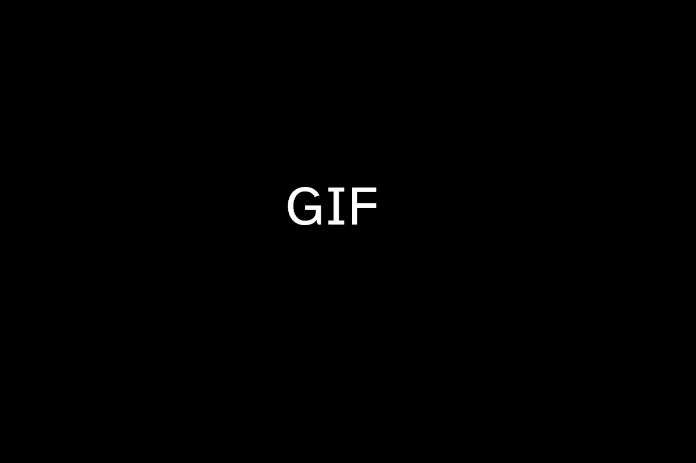

# HTML

**Hyper Text Markup Language (HTML)** je označevalni jezik pri katerem se preko značk in atributov izdelujejo spletne strani.
Poleg prikaza dokumenta v spletnem brskalniku se z njim hkrati določi tudi zgradba in semantični pomen delov dokumenta.

HTML dokument je sestavljen iz vsebine in značk, ki obdajo besedilo z dodatnim kontekstom.
Za razliko od markdowna, datoteke ne bomo prevedli znotraj VSCode-a, temveč jih bomo zgolj odprli znotraj spletnih brskalnikov (primer: Chrome, Safari, Edge, Firefox).

::::{grid} 2
:::{tip} Uporaba
- Izdelovanje spletnih strani.
- Izdelovanje spletnih aplikacij.
:::
:::{hint} Primeri spletnih urejevalnikov
- [HTML Online Viewer](https://html.onlineviewer.net/)
- [HTML Edit](https://htmledit.squarefree.com/)
- [OneCompiler](https://onecompiler.com/html)
:::
::::

## Značke

Značke označujemo s pomočjo lomljenih oklepajev `<` in `>`.

::::{grid} 2
:::{note .simple icon=false} Vzorec
```{code} html
<znacka>
```
:::
:::{tip .simple icon=false} Primer
```{code} html
<blockquote>
```
:::
::::

Vsaka značka ima svojo začetno in zaključno značko, ki ju razločujemo s poševnico `/`.

::::{grid} 2
:::{note .simple icon=false} Vzorec
```{code linenos=true} html
<znacka>
    ...
</znacka>
```
:::
:::{tip .simple icon=false} Primer
```{code linenos=true} html
<strong>
    Pišem odebeljen tekst.
</strong>
```
:::
::::

Značke lahko gnezdimo eno v drugo.

::::{grid} 2
:::{note .simple icon=false} Vzorec
```{code linenos=true} html
<znacka_1>
    ...
    <znacka_2>
        ...
    </znacka_2>
    ...
</znacka_1>
```
:::
:::{tip .simple icon=false} Primer
```{code linenos=true} html
<blockquote>
    Vprašanja
    <strong>
        vodijo
    </strong>
    do odgovorov.
</blockquote>
```
:::
::::

Pri tem moramo biti pozorni, da notranjo značko vedno zapremo pred zunanjo.

::::{grid} 2
:::{danger icon=false} ❌ Narobe
```{code linenos=true} html
:emphasize-lines: 5, 7
<znacka_1>
    ...
    <znacka_2>
        ...
    </znacka_1>
    ...
</znacka_2>
```
:::
:::{tip icon=false} ✅ Pravilno
```{code linenos=true} html
:emphasize-lines: 5, 7
<znacka_1>
    ...
    <znacka_2>
        ...
    </znacka_2>
    ...
</znacka_1>
```
:::
::::

Značke lahko vsebujejo tudi atribute, ki jim dodajo dodaten kontekst.

::::{grid} 2
:::{note .simple icon=false} Vzorec
```{code linenos=true} html
<znacka atribut_1="...">
    ...
</znacka>
```
:::
:::{tip .simple icon=false} Primer
```{code linenos=true} html
<a href="#" title="povezava">
  Klikni tukaj
</a>
```
:::
::::

Nekatere značke ne potrebujejo zaključne značke, ker nimajo vsebine.

::::{grid} 2
:::{note .simple icon=false} Vzorec
```{code} html
<znacka atribut_1="...">
```
:::
:::{tip .simple icon=false} Primer
```{code} html
<meta charset="UTF-8">
```
:::
::::

(seznam-znack)=
## Seznam značk

Obširnejša dokumentacija je na voljo na spletni strani [eNSA](https://nsa-splet.si/html/html.php) ali [W3Schools](https://www.w3schools.com/html/default.asp).

### Glava dokumenta

|                   |                                                     |
|-------------------|-----------------------------------------------------|
| `<!DOCTYPE html>` | Označba za HTML datoteko verzije HTML5              |
| `<html>`          | Koren HTML datoteke                                 |
| `<head>`          | Opredeljuje metapodatke                             |
| `<title>`         | Naslov spletne strani                               |
| `<meta>`          | Metapodatek o HTML dokumentu                        |
| `<link>`          | Razmerje med trenutnim dokumentom in zunanjim virom |

:::{dropdown} 🛠️ Prikaz uporabe

:::

### Telo dokumenta

|                  |                                  |
|------------------|----------------------------------|
| `<body>`         | Opredeljuje vidno vsebino strani |
| `<div>`          | Opredeljuje odsek                |
| `<span>`         | Opredeljuje odsek v vrstici      |

:::{dropdown} 🛠️ Prikaz uporabe

:::

### Osnovne značke

|                           |                     |
|---------------------------|---------------------|
| `<!--` ... `-->`          | Komentar            |
| `<h1>`, `<h2>` ... `<h6>` | Naslov              |
| `<p>`                     | Odstavek            |
| `<em>`                    | Poševno besedilo    |
| `<strong>`                | Odebeljeno besedilo |
| `<a>`                     | Povezava            |
| ``                   | Slika               |
| `<br>`                    | Prazna vrstica      |
| `<hr>`                    | Vodoravna črta      |
| `<code>`                  | Koda                |
| `<kbd>`                   | Tipka               |
| `<blockquote>`            | Citat               |

:::{dropdown} 🛠️ Prikaz uporabe

:::

### Seznami

|        |                  |
|--------|------------------|
| `<li>` | Element seznama  |
| `<ul>` | Neurejen seznam  |
| `<ol>` | Urejen seznam    |
| `<dl>` | Seznam opisov    |
| `<dt>` | Seznam izrazov   |
| `<dd>` | Seznam definicij |

:::{dropdown} 🛠️ Prikaz uporabe

:::

### Tabele

|           |                          |
|-----------|--------------------------|
| `<table>` | Koren tabele             |
| `<tr>`    | Vrstica v tabeli         |
| `<td>`    | Celica v tabeli          |
| `<th>`    | Naslovna celica v tabeli |

:::{dropdown} 🛠️ Prikaz uporabe

:::

## Ustvarjanje nove datoteke

Vsaka HTML datoteka je sestavljena po sledeči strukturi.

:::{note .simple icon=false} Vzorec
```{code linenos=true label=struktura} html
<!DOCTYPE html>
<html>
  <head>
    ...
  </head>
  <body>
    ...
  </body>
</html>
```
:::
:::{tip .simple .simple icon=false} Primer
```{code linenos=true} html
<!DOCTYPE html>
<html>
  <head>
    <title>Sem naslov spletne strani</title>
  </head>
  <body>
    <!-- Sem komentar -->
    <h1>Sem naslov</h1>
    <p>Sem odstavek s <a href="https://www.fmf.uni-lj.si/">povezavo</a>.</p>
  </body>
</html>
```
:::

::::{tab-set}
:::{tab-item} Windows
:sync: win
1. Odprite **VSCode**.
2. Uporabite bližnjico {kbd}`Ctrl+N`, da ustvarite novo datoteko.
3. Zapišite osnovno HTML {ref}`strukturo <struktura>`.
4. Dodajte poljubne {ref}`značke <seznam-znack>`.
4. Uporabite bližnjico {kbd}`Ctrl+S`, da shranite datoteko.
5. Datoteki dodajte končnico `.html`, da se bo datoteka shranila kot HTML datoteka.


:::
:::{tab-item} Mac
:sync: mac
...
:::
:::{tab-item} Linux
:sync: lin
...
:::
::::

## Odpiranje datoteke

HTML datoteko lahko odpremo v poljubnem brskalniku.

:::::{tab-set}
::::{tab-item} Windows
:sync: win
:::{dropdown} 🌐 Chrome

:::
:::{dropdown} 🌊 Edge

:::
:::{dropdown} 🦊 Firefox

:::
::::
::::{tab-item} Mac
:sync: mac
...
::::
::::{tab-item} Linux
:sync: lin
...
::::
:::::

## Orodja za razvijalce

Orodja za razvijalce omogočajo pregledovanje, urejanje in razhroščevanje spletnih strani in aplikacij, neposredno znotraj brskalnika.

:::{dropdown} 🌐 Chrome

:::
:::{dropdown} 🧭 Safari

:::
:::{dropdown} 🌊 Edge

:::
:::{dropdown} 🦊 Firefox

:::

## VSCode razširitve in funkcije

Predlagamo, da si naložite nekatere razširitve za VSCode za lažje urejanje HTML datotek.

::::{tab-set}
:::{tab-item} Windows
:sync: win
### HTML Preview

HTML Preview je razširitev, ki omogoča ogled HTML prikaza znotraj VSCode-a.

1. Odprite **VSCode**.
2. Uporabite bližnjico {kbd}`Ctrl+Shift+X`, da odprete stransko okno z razširitvami.
3. Poiščite razširitev **HTML Preview** (avtor: George Oliveira).
4. Razširitev namestite.
5. Uporabite bližnjico {kbd}`Ctrl+K`{kbd}`V`, da odprete HTML predogled.


### HTMLHint

HTMLHint je razširitev, ki vam bo sama pokazala sintaktične in druge napake ob pisanju HTML datotek znotraj VSCode-a.

1. Odprite **VSCode**.
2. Uporabite bližnjico {kbd}`Ctrl+Shift+X`, da odprete stransko okno z razširitvami.
3. Poiščite razširitev **HTMLHint** (avtor: HTMLHint).
4. Razširitev namestite.


### Wrap with Abbreviation

Z uporabo [palete ukazov](VSCode.md/#paleta-ukazov) je mogoče hitro obdati besedilo s HTML značko.

1. Odprite poljuben HTML dokument v VSCode-u.
2. Z uporabo tipkovnice ali miške izberite poljuben odsek besedila.
3. Uporabite bližnjico {kbd}`Ctrl+Shift+P`, da odprete paleto ukazov.
4. V paleto ukazov zapišite `wrap`.
5. Izvedite ukaz **Wrap with Abbreviation**, ki ga izvedete s tipko {kbd}`Enter`.
6. Vpišite ime poljubne značke in pritisnite {kbd}`Enter`.


:::
:::{tab-item} Mac
:sync: mac
...
:::
:::{tab-item} Linux
:sync: lin
...
:::
::::