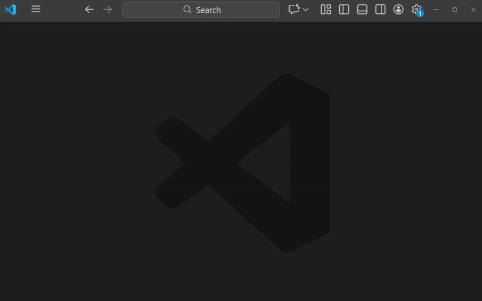
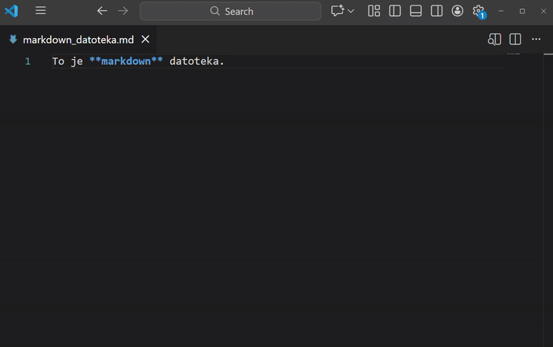

# Markdown

**Markdown** je označevalni jezik za ustvarjanje oblikovanega besedila. Da dobimo želeni prikaz, je potrebno datoteko prevesti. Ker VSCode že vsebuje pripomočke za prevajanje, dodatna namestitev ni potrebna.

:::{hint} Primeri spletnih urejevalnikov
- [Dillinger](https://dillinger.io/)
- [Markdown Live Preview](https://markdownlivepreview.com/)
- [StackEdit](https://stackedit.io/)
:::

(sintaksa)=
## Sintaksa

### Naslovi

::::{grid} 2
:::{note .simple icon=false} Markdown
`# Naslov`
:::
:::{tip .simple icon=false} Prevedeno
<span style="font-size: 2em">Naslov</span>
:::
:::{note .simple icon=false} Markdown
`## Naslov`
:::
:::{tip .simple icon=false} Prevedeno
<span style="font-size: 1.5em">Naslov</span>
:::
:::{note .simple icon=false} Markdown
`### Naslov`
:::
:::{tip .simple icon=false} Prevedeno
<span style="font-size: 1em">Naslov</span>
:::
::::

### Oblikovanje

::::{grid} 2
:::{note .simple icon=false} Markdown
`*Poševno* besedilo`
:::
:::{tip .simple icon=false} Prevedeno
*Poševno* besedilo
:::
:::{note .simple icon=false} Markdown
`**Krepko** besedilo`
:::
:::{tip .simple icon=false} Prevedeno
**Krepko** besedilo
:::
:::{note .simple icon=false} Markdown
`***Krepko in poševno*** besedilo`
:::
:::{tip .simple icon=false} Prevedeno
***Krepko in poševno*** besedilo
:::
::::

### Odstavki

Odstavki se naredijo samodejno, če je med vhodnim besedilom prazna vrstica.

::::{grid} 2
:::{note .simple icon=false} Markdown
`To je prva poved.`

`To je druga poved.`
:::
:::{tip .simple icon=false} Prevedeno
To je prva poved.

To je druga poved.
:::
:::{note .simple icon=false} Markdown
`To je prva poved.`\
`To je druga poved.`
:::
:::{tip .simple icon=false} Prevedeno
To je prva poved.
To je druga poved.
:::
::::

### Povezave

::::{grid} 1
:::{note .simple icon=false} Markdown
`Poglej na [spletno stran](https://www.fmf.uni-lj.si).`
:::
:::{tip .simple icon=false} Prevedeno
Poglej na [spletno stran](https://www.fmf.uni-lj.si).
:::
::::

### Slike

:::{note .simple icon=false} Markdown
``
:::
:::{tip .simple icon=false} Prevedeno

:::

### Seznami

::::{grid} 2
:::{note .simple icon=false} Markdown
`1. Prvi element`<br>
`2. Drugi element`<br>
`3. Tretji element`
:::
:::{tip .simple icon=false} Prevedeno
1. Prvi element
2. Drugi element
3. Tretji element
:::
:::{note .simple icon=false} Markdown
`- Element 1`<br>
`- Element 2`<br>
`- Element 3`
:::
:::{tip .simple icon=false} Prevedeno
- Element 1
- Element 2
- Element 3
:::
::::

### Citati

::::{grid} 2
:::{note .simple icon=false} Markdown
`> Danes je lep dan.` 
:::
:::{tip .simple icon=false} Prevedeno
> Danes je lep dan.
:::
::::

### Koda

::::{grid} 2
:::{note .simple icon=false} Markdown
`` `print("Hello")` ``
:::
:::{tip .simple icon=false} Prevedeno
`print("Hello")`
:::
:::{note .simple icon=false} Markdown
` ```python`<br>
`print("Hello")`<br>
` ``` `
:::
:::{tip .simple icon=false} Prevedeno
```python
print("Hello")
```
:::
::::

## Ustvarjanje nove datoteke

::::{tab-set}
:::{tab-item} Windows
:sync: win
1. Odprite **VSCode**.
2. Uporabite bližnjico {kbd}`Ctrl+N`, da ustvarite novo datoteko.
3. Zapišite poljubno besedilo z uporabo markdown [sintakse](#sintaksa).
4. Uporabite bližnjico {kbd}`Ctrl+S`, da shranite datoteko.
5. Datoteki dodajte končnico `.md`, da se bo datoteka shranila kot markdown datoteka.


:::
:::{tab-item} macOS
:sync: mac
1. Odprite **VSCode**.
2. Uporabite bližnjico {kbd}`Cmd+N`, da ustvarite novo datoteko.
3. Zapišite poljubno besedilo z uporabo markdown [sintakse](#sintaksa).
4. Uporabite bližnjico {kbd}`Cmd+S`, da shranite datoteko.
5. Datoteki dodajte končnico `.md`, da se bo datoteka shranila kot markdown datoteka.


:::
::::

## Prevajanje datoteke

::::{tab-set}
:::{tab-item} Windows
:sync: win
1. Odprite markdown datoteko z **VSCode**.
2. Uporabite bližnjico {kbd}`Ctrl+K`{kbd}`V`, da odprete nov zavihek, kjer se nahaja predogled markdown datoteke.


:::
:::{tab-item} macOS
:sync: mac
1. Odprite markdown datoteko z **VSCode**.
2. Uporabite bližnjico {kbd}`Cmd+K`{kbd}`V`, da odprete nov zavihek, kjer se nahaja predogled markdown datoteke.


:::
::::

## Naloge

:::::{note icon=false} Naloga

Kopirajte spodnje golo besedilo in z uporabo markdown sintakse uredite besedilo tako, da bo prevedeno podobno spodnjemu prevedenemu besedilu.

::::{tab-set}
:::{tab-item} Golo besedilo
:sync: gb
```
Računalniški praktikum

Predavanja

Predavanja za računalniški praktikum potekajo vsak petek ob 10.00.
Vso gradivo se nahaja na spletni strani od predavanj
(https://racunalniski-praktikum.github.io/predavanja/).

Vaje

Vaje so namenjene za ponavljanje in utrjevanje snovi.

Kot pravi rek:
    Vaja dela mojstra.

Pretekli teden smo tako na vajah delali sledeče:
    namestili VSCode,
    ustvarili svojo prvo tekstovno datoteko,
    prevedli markdown datoteko.
```
:::
:::{tab-item} Prevedeno besedilo
:sync: pb
<span style="font-size: 2em">Računalniški praktikum</span>

<span style="font-size: 1.5em">Predavanja</span>

Predavanja za **računalniški praktikum** potekajo vsak petek ob `10.00`. Vso gradivo se nahaja na [spletni strani od predavanj](https://racunalniski-praktikum.github.io/predavanja/).

<span style="font-size: 1.5em">Vaje</span>

Vaje so namenjene za ponavljanje in utrjevanje snovi.

Kot pravi rek:
> Vaja dela mojstra.

Pretekli teden smo tako na vajah delali sledeče:
- namestili *VSCode*,
- ustvarili svojo prvo tekstovno datoteko,
- prevedli ***markdown*** datoteko.
:::
::::
:::::

:::{tip .dropdown icon=false} Rešitev
```{code} markdown
# Računalniški praktikum

## Predavanja

Predavanja za **računalniški praktikum** potekajo vsak petek ob `10.00`.
Vso gradivo se nahaja na [spletni strani od predavanj](https://racunalniski-praktikum.github.io/predavanja/).

## Vaje

Vaje so namenjene za ponavljanje in utrjevanje snovi.

Kot pravi rek:
> Vaja dela mojstra.

Pretekli teden smo tako na vajah delali sledeče:
- namestili *VSCode*,
- ustvarili svojo prvo tekstovno datoteko,
- prevedli ***markdown*** datoteko.
```
:::